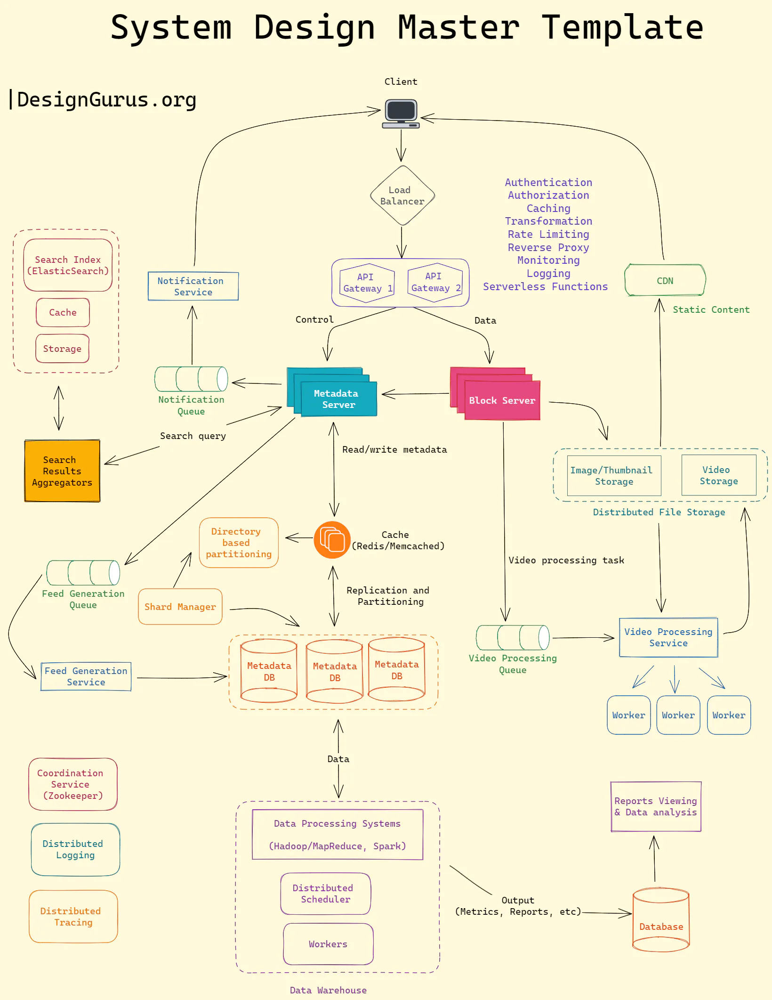
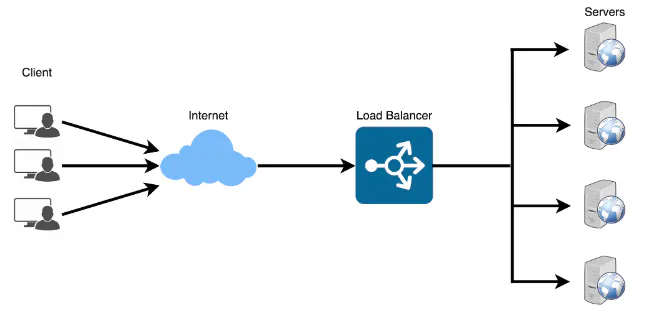

# System Design Master template

## 1. DNS
* translates User friendly domain names into IP address
* Like a phone book for internet. 
* When you input a Domain in your browser DNS finds the matching IP address.
* Browser sending a query to a recursive resolver, 
  * which then searches a series of DNS servers, 
    * beginning with the root server, 
      * followed by the Top-Level Domain (TLD) server, and 
        * ultimately the authoritative name server.

## 2. Load Balancer
* networking device or software designed to distribute incoming network traffic across multiple servers, ensuring optimal resource utilization, reduced latency, and maintained high availability
* efficiently managing server workloads,
* This is useful when sudden surge in traffic or uneven distribution of requests
* Common Algorithms
  * Round Robin: Sequentially distributing load
  * Least Connection: Assigns to server with fewest connection, giving priority to least busy server.
  * IP Hash: The client's IP address is hashed, and the resulting value is used to determine which server the request should be directed to. This ensures there is session persistence by keeping to send a particular clients request to same server.

## 3. APIGateway
* It acts like an server or service that functions as an intermediary between external clients and the internal microservices or API-based backend services of an application. 
* it streamlines the communication process and offers a single entry point for clients to access various services.
* **Primary Responsibilities**
  * **Request Routing**