# A Design Analysis of Cloud-based Microservices Architecture at Netflix
* Due to an outage in 2008 for 3 days, Netflix made 2 important decision to avoid single point of failures: 
    * Migrating the IT Infra to public cloud 
    * replacing monolith programs with small managable software components by microservice architecture.

* Moving to AWS helped netflix becuase now **Netflix did not do the undifferentiated heavy lifting work of building data centers but focusing more on core business of providing high quality video streaming user experience.** 
 

* Microservices encourages **seperation of concerns** and promotes **modularity with data encapsulation** 
* it also promotes **horizontal scalaing** and **workload partitioning** and **faster deployments**
* it can help **track performance of each service** and isolate its issue from other running services. 

#### Some Important System Considerations 
* Availibility 
* Latency( how long it takes for packets to reach their destination.)
* Scalability 
* Throughput( the number of packets that are processed within a specific period of time)
* Resilence to network failures or system outages. 

## Architecture 
* Netflix uses **AWS and [OpenConnect](https://openconnect.netflix.com/en_gb/)**(purpose-built Content Delivery Network (CDN) responsible for serving 100% of thier video traffic.)
 

* Netflix 3 Main components: 
    * **Client** 
    * **Backend**
    * **Content Delivery Network(CDN)**
 

* **CLIENT** 
    * Any supported browsers on a laptop or desktop or a Netflix app on smart phone or smart TVs. 
    * Netflix has it's own Andriod and iOS apps
 

* **BACKEND** 
    * It includes Services, Databases, Storages running entirely on AWS cloud. 
    * Backend handles everything not involving streaming videos. 
    * Some Backend Components are listed below: 
        * Scalable computing instances (AWS EC2)
        * Scalable storage (AWS S3)
        * Business logic microservices (purpose-built frameworks by Netflix)
        * Scalable distributed databases (AWS DynamoDB, Cassandra)
        * Big data processing and analytics jobs (AWS EMR, Hadoop, Spark, Flink, Kafka and other purpose-built tools by Netflix)
        * Video processing and transcoding (purpose-built tools by Netflix)
 

* **OPENCONNECT CDN** 
    * It is a network of servers called Open Connect Appliances (OCAs) oprimized for storing and streaming large videos. 
    * These OCAs are placed inside Internet Service Providers (ISPs) amd Internet Exchange Locations(IXPs) network around the world 
    * OCAs are reponsible for streaming videos directly to the clients. 

### Playback Architecture 
* On Press of play button, Client talks to Both Backend on AWS and OCAs on netflix CDN to stream videos. 
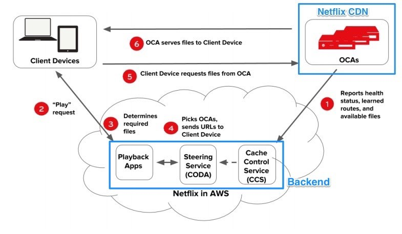
 

1. OCAs constantly send health reports about thier workload status, routability and available videos to Cache Control Service running in AWS EC2 in order for Playback Apps to update the latest healthy OCAs to clients. 
2. A Play request is sent from the client device to Netflix's Playback Apps service running on AWS EC2 to get URLs for streaming videos. 
3. Playbacks apps service must determine that Play request would be valid in order to view the particular video. Such validations would check subscriber's plan, licensing of video in different countries, etc. 
4. Playback Apps service talks to steering service also running in AWS EC2 to get the list of appropriate OCAs servers of the requested video. Steering service uses the client’s IP address and ISPs information to identify a set of suitable OCAs work best for that client.
5. From the list of 10 different OCAs servers returned by Playback Apps service, the client tests the quantity of network connections to these OCAs and selects the fastest, most reliable OCA to request video files for streaming. 
6. the selected OCA server accepts requests from the client and starts streaming videos. 
 

## Backend Architecture
* Backend handles most of things like Sign up, login, billing to more complex task such as video transcoding and personilized recommendations. 
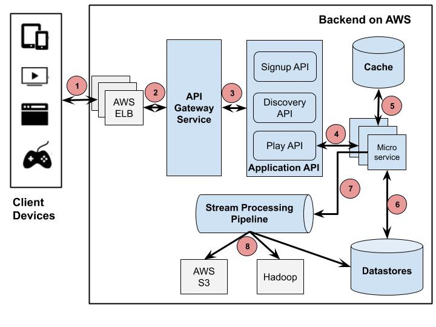

1. The Client sends a Play request to Backend running on AWS. That request is handled by AWS Load balancer (ELB)
2. AWS ELB will forward that request to API Gateway Service(**ZUUL**) running on AWS EC2 instances. ZUUL is used to allow **dynamic routing, traffic monitoring and security, resilience to failure** at edge of the cloud deployment. 
Then request is forwarded to Application API for further processesing. 
3. Application API component is core business logic behind Netflix operations. 
4. Play API will call a microservice to fullfill the request. 
5. Microservices are **mostly stateless small programs and can call each others**. 
> **NOTE** - To control its cascading failure and enable resilience, each microservice is isolated from the caller process by **[Hystrix](https://github.com/Netflix/hystrix)**(Used to handle fault tolerance)
6. Microservices save or get data from data store. 
7. Microservices can send events for tracking user activities or other data to stream processing pipeline for either real-time processing of personalized recommendation or batch processing of business intelligence tasks. 
8. The data coming out of the Stream Processing Pipeline can be persistent to other data stores such as AWS S3, Hadoop HDFS, Cassandra, etc.
 

## Components 
### Client 
*  any device environment needs to install **Netflix Ready Device Platform (NRDP)** in order to enable the best possible Netflix viewing experience
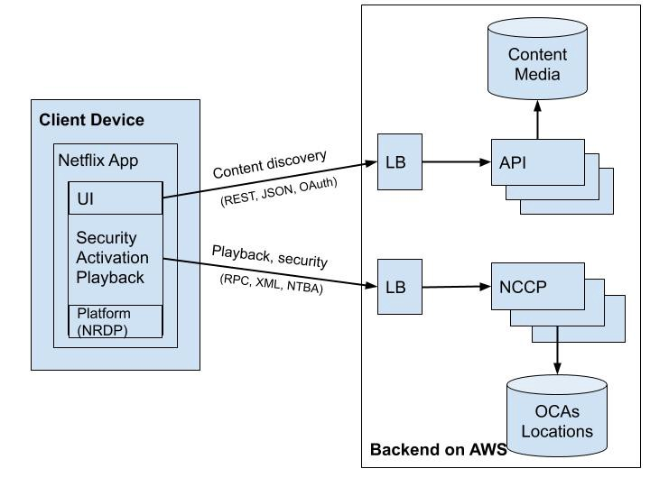
* Client Apps separate 2 types of connections to Backend for content discovery and playback.
    *  Client uses NTBA protocol for Playback requests to ensure more security over its OCA servers locations and to remove the latency caused by a SSL/TLS handshake for new connections.
* While streaming, the client app intelligently lowers the video quality or switches to different OCA servers if network connections are overloaded or have errors. Client apps can easily change to another OCA. All this is possible because their Platform SDK on client keeps tacking the latgest healthy OCAs retrieved from playback apps service. 
 

### Backend 
#### API Gateway Service
* This communicates to AWS Load Balancers to resolve all requests from the clients. 
* This can be deployed to multiple EC2 Instances across globe to resolve all request from clients. 
* Below Image shows ZUUL implementation 
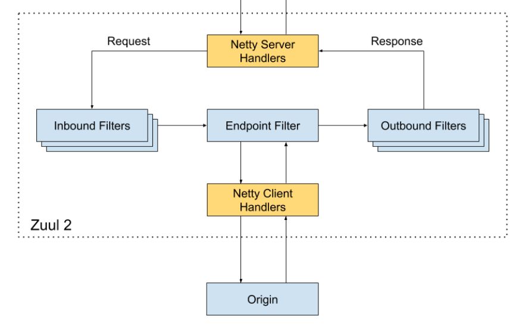
* **Inbound Filters** Can be used for authentication, routing and decorating the request
* **Endpoint filters**  - can be used to return static resources or route the request to appropriate origin or Application API 
* **Outbound filters** - Can be used for **tracking metrics, decorating the response** to the user or adding custom headers. 
* ZUUL is able to **discover new applicatiopn API by integrating with the service discover **[Eureka](https://github.com/netflix/eureka)****
* It is used to route traffic
 

#### Application API 
* This plays role of **orchestration layer** 
* THe API provides **logic of composing calls to underlying microservices in the order needed** with additional data from other data stores to construct appropriate responses. 
* This is highly scalable and available under high request volumes. 
* CUrrently this is divided in 3 main categories 
    * Sign Up API (non member request such as sign-up , billing, free-trial, etc)
    * Disovery API (search and recomendation requests)
    * Play API for streaming, view licensing requests. 
    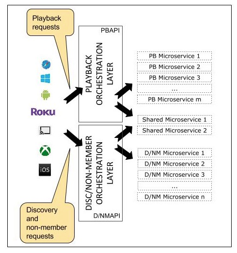
> **NOTE** In a recent update of Play API the network protocol between Play API and microservices is **gRPC/HTTP2** which allowed `allowed RPC methods and entities to be defined via protocol buffers, and client libraries and SDKs automatically generated in variety of languages`
* Application provides a common resilient mechanism based on *hystrix* commands to protect its underlying microservices. 
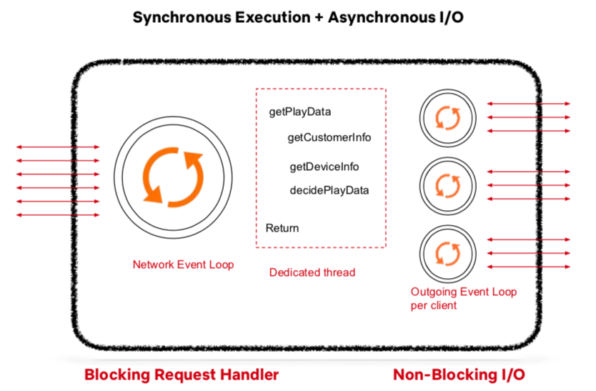
* Each request from API gateway will be placed in network event loop for processing 
* Each request will be blocked by a dedicated thread handler which places Hystrix commands such as getCustomerInfo, getDeviceInfo, etc. into the Outgoing Event Loop. This Outgoing Event Loop is set up per client and runs with non-blocking I/O. Once the calling microservices finish or timeout, the dedicated thread would construct corresponding responses.
 

#### Microservices 
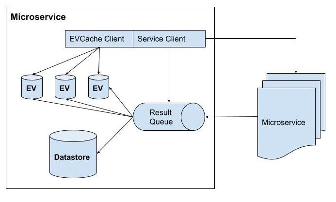
* A microservice can work on it's own or call other microservices via REST or gRPC 
* Implementation of microservice can be similar to Application API (putting to event loop part)
* Each microservice has its own data store and some in memory cach stores of recent result 
* **[EVCAche](https://github.com/Netflix/EVCache)** is primary choice of cache. 
 

#### Data Stores
* 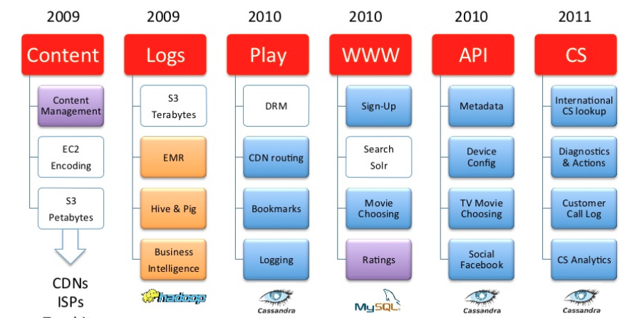
* MySQL db is used for movie title management and transactional billing purposes. 
* Hadoop is used for big data processign based on user logs. 
* ES is used for searching titles on Netflix Apps 
* Cassandra is distributed column based NoSQL data store to handle large amounts of read requests with no single point of failure. **Cassandra is used because of its eventually consistent ability** 
 

##### Stream Processing Pipeline 
* It is backbone for **Business analytics and personalized recommendation tasks** 
* It is responsible for **collecting, processing, aggregating and moving all microservice events** to other data processors in near real time. 
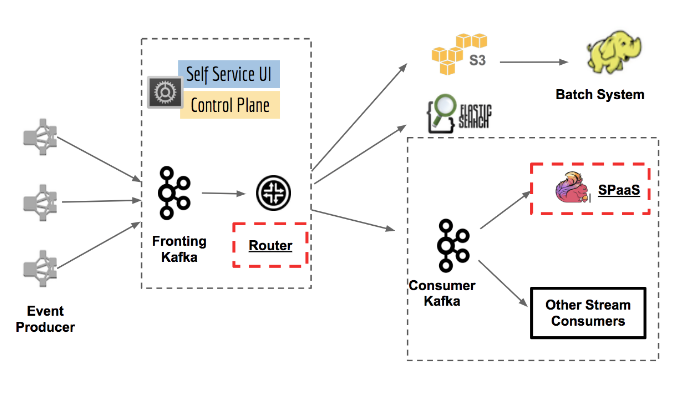
* It can process trillions of events and petabytes of data per day. It can autoscale as well. 
* The **Router** module enables routing to different **Data sinks or applications**
* The **kafka** is responsible for routign messages as well as buffering for downstream systems. 
* Stream Processing as a service (**SPaaS**) lets data engineer build and monitor their own pipelines without worrying about scalability and operations 

### Open Connect
* it is global CDN. 
* Netflix has been in partnership with Internet Service Providers (ISPs) and Internet Exchange Points (IXs or IXPs) around the world to deploy specialized devices called Open Connect Appliances (OCAs) inside their network 
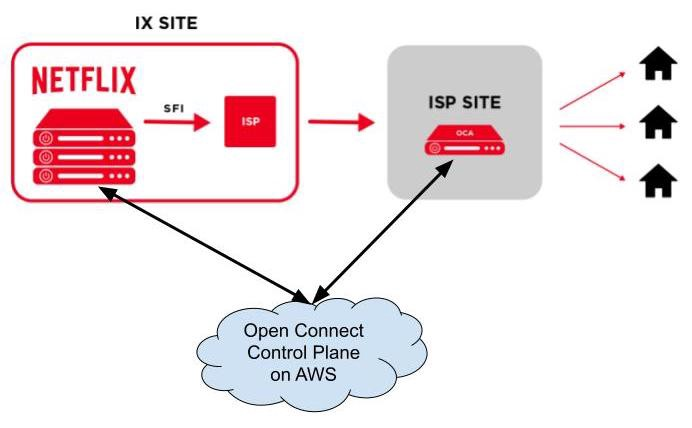
* OCAs are optimized to store and serve large files. 
* These servers periodically report health metrics optimal routes they learned from IXP/ISP networks and what videos they store on their SSD disks to Open Connect Control Plane services on AWS. 
* In return, the control plane services would take such data to direct client devices automatically to the most optimal OCAs given the file availability, server health and network proximity to the clients.
The control plane services also control filling behaviour of adding new files or updating files on OCAs nightly. 
    * When new video files have been transcoded successfully and stored on AWS S3, the control plane services on AWS will transfer these files to OCAs servers on IXP sites. These OCAs servers will apply cache fill to transfer these files to OCAs servers on ISPs sites under their sub networks.
    * When an OCA server has successfully stored the video files, it will be able to start the peer fill to copy these files to other OCAs servers within the same site if needed.
    * Between 2 different sites which can see each other IP addresses, the OCAs can apply the tier fill process instead of a regular cache fill.
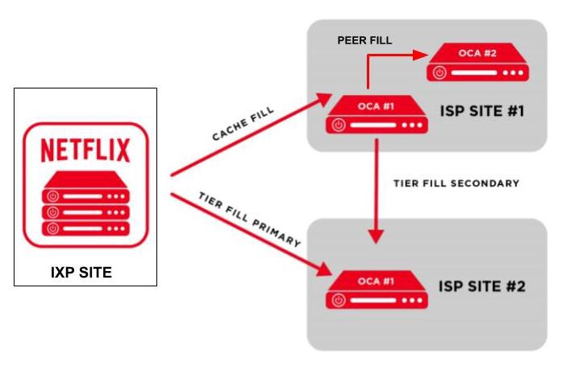
---
## Design Goals 
> * Ensuring **High Availability**
> * Tackle system failures and system outages by **resilience**
> * Minimize streaming **latency** for every supported device under different network conditions. 
> * Support scalability upon high request volume

### High availability 
* **DEFINITION** - How many times a response would be fulfilled for a request within a period of time, without gaurentte tthat it contains most recent version of the information. 
* In this scenario this would depend upon both OCAs and backend services.
* Goal of backend service is to get **list of most healthy OCAs proximity to a specific client** either from cache or by execution of some microservices. 

> Load balancers can improve the availability by routing traffic to different proxy servers to help prevent overloading workloads.
Play API controls the execution of microservices with timeout via Hystrix commands which could help to prevent cascading failures to further services.
Microservices can respond to Play AI with data in cache in case the call to outside services or data stores takes more time than expected.
Cache is replicated for faster access.

* If that OCA is overloaded or failed during the streaming process, then the client switches to another good one or the Platform SDK would request other OCAs

### Low latency 
* This depends on how fast Play API can resolve the list of healthy OCAs and how well the connection of a client to the chosen OCA server.
* Play API does not wait for a microservice’s execution forever since it uses Hystrix commands to control how long it would like to wait for the result before it gets the not-up-to date data from the cache

## Tradeoffs
1. Low latency over consistency 
2. High availability over consistency 

* Latency over Consistency trade-off is built into the architecture design of Backend services. Play API can get stale data from EVCache stores or from eventually consistent data stores like Cassandra.

* Similarly, Availability over Consistency trade-off would prefer constructing responses in acceptable latency without requiring the execution of microservices on latest data in data stores like Cassandra.

## Resilience 
> A failure in resolving service dependencies.
A failure of executing a microservice would cause cascading failures to other services.
A failure of connecting to an API due to overloading.
A failure of connecting to an instances or servers such as OCAs.

* to detect and recover from failures, ZUUL has built in features like **adaptive-retires, limiting concurrent calls to application API** 
* APPlication api uses Hystrix commands to timeout calls to microservices, to stop cascading failures and isolate points of failures from others. 

## Scalability 
1. horizontal scaling, (EC2)
2. parallel execution 
3. database partitioning. 

* Netflix has built **titus** open source **container management platform** to run about 3 million containers per week. Titus allows to run these containers across multiple regions. 

* use of casandra and Elastic Search 
