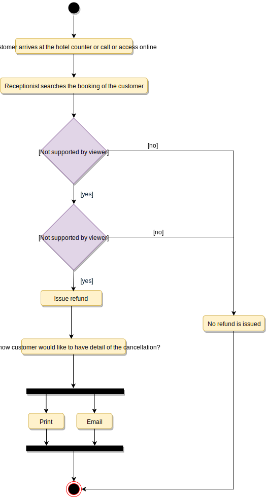

# Hotel Management System Design 
## Overview 
* Handle all online hotel activities easily and safely. 
* Manage all hotel management operations from a single portal. 

## System Requirements
1. Support booking of different rooms types **standard, deluxe, family suite** 
2. Guest should be able to search the **room inventory** and book any available room. 
3. Should be able to retrieve information about who booked and what rooms are booked by specific customer.
4. Allow **Cancellations**
5. Sending Notification when nearing Check-in and Check-out
6. Maintain House Keeping Logs 
7. ANy Customer should be able to add room services and food items
8. Customer can ask for different amenities.
9. Bill Payment through various Payment Modes. 

## Use Case Diagram 
### Actors 
1. `Guest`: All guests can search the available rooms, as well as make a booking.
2. `Receptionist`: Mainly responsible for adding and modifying rooms, creating room bookings, check-in, and check-out customers.
3. `System`: Mainly responsible for sending notifications for room booking, cancellation, etc.
4. `Manager`: Mainly responsible for adding new workers.
5. `Housekeeper`: To add/modify housekeeping record of rooms.
6. `Server`: To add/modify room service record of rooms.
 

### Top Use Cases 
1. `Add/Remove/Edit room`: To add, remove, or modify a room in the system.
2. `Search room`: To search for rooms by type and availability.
3. `Register or cancel an account`: To add a new member or cancel the membership of an existing member.
4. `Book room`: To book a room.
5. `Check-in`: To let the guest check-in for their booking.
6. `Check-out`: To track the end of the booking and the return of the room keys.
7. `Add room charge`: To add a room service charge to the customer’s bill.
8. `Update housekeeping log`: To add or update the housekeeping entry of a room.
 

### Use Case Diagram 

 

## Class Diagram 
1. **Hotel and HotelLocation:** Our system will support multiple locations of a hotel.
2. **Room**: The basic building block of the system. Every room will be uniquely identified by the room number. Each Room will have attributes like Room Style, Booking Price, etc.
3. **Account**: We will have different types of accounts in the system: one will be a guest to search and book rooms, another will be a receptionist. Housekeeping will keep track of the housekeeping records of a room, and a Server will handle room service.
4. **RoomBooking**: This class will be responsible for managing bookings for a room.
5. **Notification**: Will take care of sending notifications to guests.
6.  **RoomHouseKeeping**: To keep track of all housekeeping records for rooms.
7. **RoomCharge**: Encapsulates the details about different types of room services that guests have requested.
8. **Invoice**: Contains different invoice-items for every charge against the room.
9. **RoomKey**: Each room can be assigned an electronic key card. Keys will have a barcode and will be uniquely identified by a key-ID.
 

## Activity Diagram
1. **Make a room booking**: Guest or receptionist can perform this. 

 
 

2. **Check In**: Guest will check in for their booking. The Receptionist can also perform this activity. Here are the steps:

 
 

3. **Cancel A Booking**: Guest can cancel their booking. Receptionist can perform this activity. 

 
 

## Code 

1. **Enums, DataTypes and Constants**: 
[Code](./constants.java)
 

2. **Account, Person, Guest, Receptionist, and Server:** Different Actors
[Code](./Actors.java)
 

3. **Hotel and Hotel Location**: Top-Level Classes of system 
[Code](./Hotel.java)
 

4. **Room, RoomKey, and RoomHouseKeeping**: To encapsulate a room, room key, and housekeeping
[Code](./Room.java)

5. **RoomBooking and RoomCharge:** To encapsulate a booking and different charges against a booking:
[Code](./Booking.java)