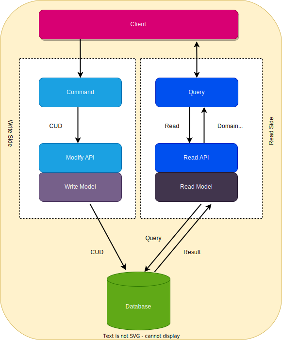
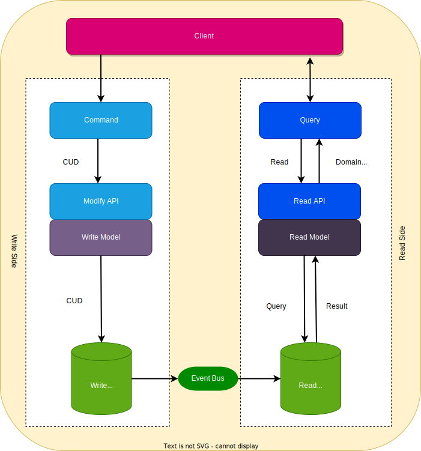
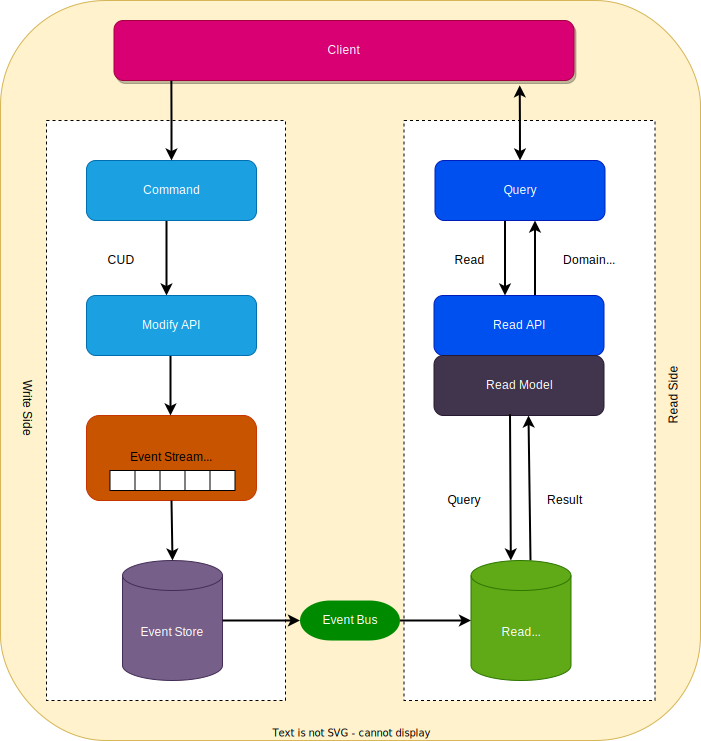

# Architecture

## Type 1: Different Command and Query Models

* **Command Model**
  * Handles all write operations
  * responsible for maintaining integrity and consistency of data. 
* **Query Model**
  * Handles all read operations.
  * provides current state of system to the users.

## Type 2: Different Read and Write databases
* We can separate read and write databases to enhance **flexibility** and **scalability**
* This add complexity of **How to propagate changes from write database to read database**
* As transactions are not atomic anymore, read and write models rely on async messaging/events for eventual consistency.
* The other complexity which this adds is 
  * out-of-order event propagation
  * event loss
  * sync discrepancies
  * read model update failure.
* For this we should master **distributed transactions**

## Event Sourcing
* using separate databases for reading and writing presents challenges which maintaining sync with eventual consistency. 
* sequence of events from write to read side is important
* many async message buses prioritize availability and performance often not ensuring the order of message delivery. 
* Event Sourcing address adopting a differentmethod for storing write models, using append only event stores to record every action on a model. 
* When updating the model is refreshed by replaying its entire event history. 
