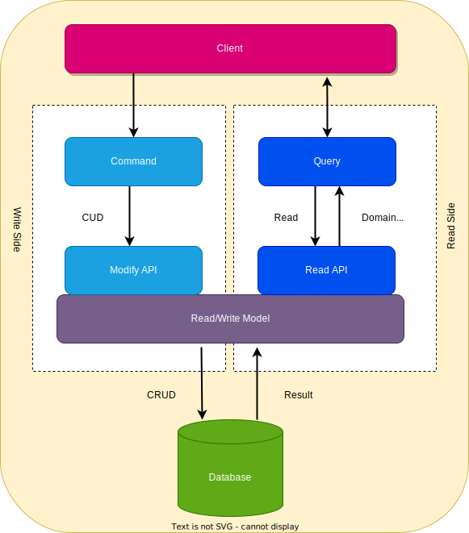

# Introduction
## THINK CQRS like Write happens against a live representation of the domain model but read happens against the cached representation.
* In monolith a single database does:
  * Complex join queries
  * CUD(Create, Update ,Delete)
* CQRS - Command Query Responsibility Separation
  * Command(Writes)
  * Query(Reads)
  * Responsibility Segregation- Separating queries and commands.

* **Why use CQRS in microservices?**
  * Scalability: Separately scale read and write workloads.
  * Optimized performance: We can use different ORM & optimization techniques for managing specific tasks.
  * Simplified complexity: By separating concerns, it becomes easier to manage the complexity of each microservice.
  * Flexibility of choosing tech stacks

## Problems with CRUD
* CRUD struggles to keep up :
  * numerous concurrent operations
  * diverse data requirements - Data how it is stored is not always in closed format to how we may query it. 
  * In systems where scale of read and write has big difference - we can't scale the read and writes independently. 
* Eg. In banking system,
  * **Writes:** Making transaction of deposit and withdrawl
  * **Reads**: Balance enquiry - reads
  * The write needs to be consistent and secure.
  * The read needs to be fast. 
  * If transactions are more secured it may hamper querying of balance and if querying of balance is made faster because of some optimization it can hamper transaction.

## CQRS

* Each method of object is now of type:
  * Query- returns a result, doesn't cause state change. 
  * Command - changes the state of system, Ideally it shouldn't return a value rather true or false indicating success.
* Why:
  * Optimization - Now we can optimize each operation idependently.
  * Simplicity: Each side can be developed and maintained separately.
  * Scalability: As your app grows, you can scale the read and write operations independently. 