# Microservices Architecture Pattern
* Below Patterns are covered as part of this documentation: 
   1. **[Strangler Fig Pattern](./1-strangler-fig-pattern.md)**: Facilitates the gradual replacement of a monolithic system with microservices, ensuring a smooth and risk-free transition.
   2. **API gateway Pattern**: Centralizes external access to your microservices, simplifying communication and providing a single entry point for client requests.
   3. **Backend for frontend (BFF)**: Creates dedicated backend services for each frontend, optimizing performance and user experience tailored to each platform.
   4. **Service Discovery Pattern**: Enables microservices to dynamically discover and communicate with each other, simplifying service orchestration and enhancing system scalability 
   5. **Circuit Breaker Pattern**: Implements a fault tolerance mechanism for microservices preventing cascading failures by automatically detecting and isolating faulty services. 
   6. **Bulkhead pattern**: Isolates microservices into separate partitions, preventing failures in one partition from effecting the entire system enhancing system resilience. 
   7. **Retry Pattern**: Enhances microservices resilience by automatically retrying failed operations, increasing the chances of successful execution and minimizing transient issues.
   8. **Sidecar Pattern**: Attaches additional components to your microservices, providing modular functionality without altering the core service itself. 
   9. **Saga Pattern**: Manages distributed transactions across multiple microservices, ensuring data consistency while maintaining the autonomy of your services. 
   10. **Event driven architecture pattern**: Leverages events to trigger actions in your services, promoting loose coupling between services and enabling real-time responsiveness. 
   11. **CQRS(Command Query Responsibility Separation)**: Separates the read and write operations in a microservice, improving performance, scalability, and maintainability. 
   12. **Configuration Externalization Pattern**: Provides a method to externalize the configuration from the code, enabling microservices to be reconfigured without the need for recompilation or redeployment. 

## Category 0f Microservices Patterns
1. [Design and Implementation](https://docs.microsoft.com/en-us/azure/architecture/patterns/category/design-implementation)
2. [Operational Excellence](https://docs.microsoft.com/en-us/azure/architecture/framework/devops/devops-patterns)
3. [Messaging](https://docs.microsoft.com/en-us/azure/architecture/patterns/category/messaging)
4. [Reliability](https://docs.microsoft.com/en-us/azure/architecture/framework/resiliency/reliability-patterns)
5. [Data Management](https://docs.microsoft.com/en-us/azure/architecture/patterns/category/data-management)
6. [Performance Efficiency](https://docs.microsoft.com/en-us/azure/architecture/framework/scalability/performance-efficiency-patterns)
7. [Security](https://docs.microsoft.com/en-us/azure/architecture/framework/security/security-patterns)

## Mind Map: Microservice Patterns
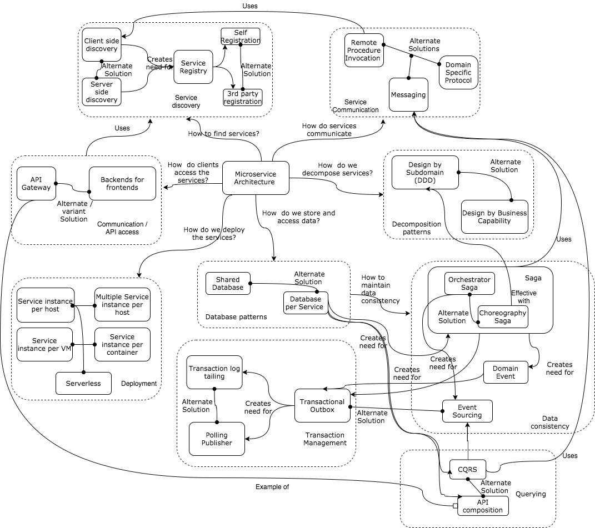

* **Goal**: Increase Velocity of application releases, by decomposing the application into small autonomous services that can be deployed independently. 
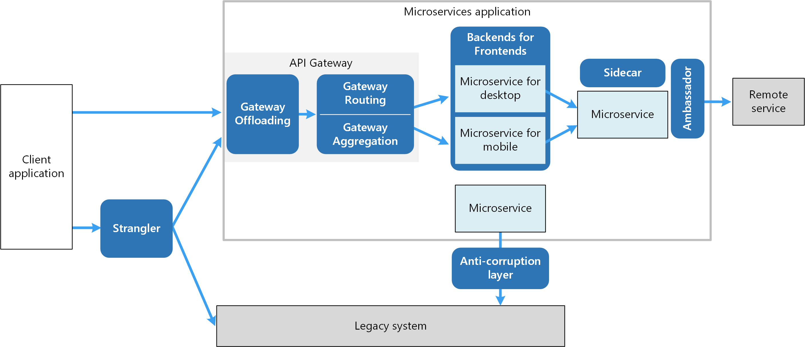
1. Ambassador
    > **Definition**: Can be used to offload common client connectivity tasks such as monitoring, logging, routing and security in language agnostic way. 
2. Anti-Corruption Layer 
    > **Definition**: Implements Facade between new and legacy apps to ensure that design of a new app is not limited by dependencies on legacy system. 
3. Backends for Frontend
    > **Definition**: Creates separate backend services for different types of clients. Single backend service doesn't need to handle all conflicting requirements of various client types.
4. Bulkhead 
    > **Definition**: It isolates critical resources such as connection pool, memory and CPU for each workload or service. By using this, a single service cant starve others. This increases **resiliency** & **prevents cascading failures**
5. Gateway Aggregation
    > **Definition**: aggregates requests to multiple individual microservices into a single request, reducing chattiness between consumers and services.
6. Gateway Offloading
    > **Definition**: enables each microservice to offload shared service functionality, such as the use of SSL certificates, to an API gateway.
7. Gateway Routing 
    > **Definition**: routes requests to multiple microservices using a single endpoint, so that consumers don't need to manage many separate endpoints.
8. Sidecar
    > **Definition**: deploys helper components of an application as a separate container or process to provide isolation and encapsulation.
9. Strangler Fig 
    > **Definition**: supports incremental refactoring of an application, by gradually replacing specific pieces of functionality with new services.

## Design Pattern Categories

### Data Management Patterns
* Data is typically hosted in different locations and across multiple servers for reasons such as performance, scalability or availability, and this can present a range of challenges.
* Additionally data should be protected at rest, in transit, and via authorized access mechanisms to maintain security assurances of confidentiality, integrity, and availability.

1. [Cache-Aside](https://docs.microsoft.com/bs-latn-ba/azure/architecture/patterns/cache-aside)
    > Load data on demand into cache from a data store
2. [CQRS](https://docs.microsoft.com/bs-latn-ba/azure/architecture/patterns/cqrs)
    > Segregate operations that read data from operations that update data by using separate interfaces.
3. [Event Sourcing](https://docs.microsoft.com/bs-latn-ba/azure/architecture/patterns/event-sourcing)
    > Use an append-only store to record the full series of events that describe actions taken on data in a domain.
4. [Index Table](https://docs.microsoft.com/bs-latn-ba/azure/architecture/patterns/index-table)
    > Create indexes over the fields in data stores that are frequently referenced by queries.
5. [Materialized View](https://docs.microsoft.com/bs-latn-ba/azure/architecture/patterns/materialized-view)
    > Generate prepopulated views over the data in one or more data stores when the data isn't ideally formatted for required query operations.
6. [Sharding](https://docs.microsoft.com/bs-latn-ba/azure/architecture/patterns/sharding)
    > Divide a data store into a set of horizontal partitions or shards.
7. [Static Content Hosting](https://docs.microsoft.com/bs-latn-ba/azure/architecture/patterns/static-content-hosting)
    > Deploy static content to a cloud-based storage service that can deliver them directly to the client.
8. [Valet Key](https://docs.microsoft.com/bs-latn-ba/azure/architecture/patterns/valet-key)
    > Use a token or key that provides clients with restricted direct access to a specific resource or service.

## Design & Implementation Pattern 
* Good design encompasses factors such as consistency and coherence in component design and deployment, maintainability to simplify administration and development, and reusability to allow components and subsystems to be used in other applications and in other scenarios.

1. [Ambassador](https://docs.microsoft.com/bs-latn-ba/azure/architecture/patterns/ambassador)
    > Create helper services that send network requests on behalf of a consumer service or application.
2. [Anti-corruption Layer](https://docs.microsoft.com/bs-latn-ba/azure/architecture/patterns/anti-corruption-layer)
    > Implement a façade or adapter layer between a modern application and a legacy system.
3. [Backend for frontends](https://docs.microsoft.com/bs-latn-ba/azure/architecture/patterns/backends-for-frontends)
    > Create separate backend services to be consumed by specific frontend applications or interfaces.
4. [CQRS](https://docs.microsoft.com/bs-latn-ba/azure/architecture/patterns/cqrs)
    > Segregate operations that read data from operations that update data by using separate interfaces.
5. [Compute Resource Consolidation](https://docs.microsoft.com/bs-latn-ba/azure/architecture/patterns/compute-resource-consolidation)
    > Consolidate multiple tasks or operations into a single computational unit
6. [External Configuration Store](https://docs.microsoft.com/bs-latn-ba/azure/architecture/patterns/external-configuration-store)
    > Move configuration information out of the application deployment package to a centralized location.
7. [Gateway Aggregation](https://docs.microsoft.com/bs-latn-ba/azure/architecture/patterns/gateway-aggregation)
    > Use a gateway to aggregate multiple individual requests into a single request.
8. [Gateway offloading](https://docs.microsoft.com/bs-latn-ba/azure/architecture/patterns/gateway-offloading)
    > Offload shared or specialized service functionality to a gateway proxy.
9. [Gateway Routing](https://docs.microsoft.com/bs-latn-ba/azure/architecture/patterns/gateway-offloading)
    > Route requests to multiple services using a single endpoint.
10. [Leader Election](https://docs.microsoft.com/bs-latn-ba/azure/architecture/patterns/leader-election)
    > Coordinate the actions performed by a collection of collaborating task instances in a distributed application by electing one instance as the leader that assumes responsibility for managing the other instances.
11. [Pipes and filters](https://docs.microsoft.com/bs-latn-ba/azure/architecture/patterns/leader-election)
    > Break down a task that performs complex processing into a series of separate elements that can be reused.
12. [Sidecar](https://docs.microsoft.com/bs-latn-ba/azure/architecture/patterns/sidecar)
    > Deploy components of an application into a separate process or container to provide isolation and encapsulation.
13. [Static Content Hosting](https://docs.microsoft.com/bs-latn-ba/azure/architecture/patterns/static-content-hosting)
    > Deploy static content to a cloud-based storage service that can deliver them directly to the client.
14. [Strangler Fig](https://docs.microsoft.com/bs-latn-ba/azure/architecture/patterns/strangler-fig)
    > Incrementally migrate a legacy system by gradually replacing specific pieces of functionality with new applications and services.

## Messaging Patterns 

1. [Asynchronous Request-Reply](https://docs.microsoft.com/bs-latn-ba/azure/architecture/patterns/async-request-reply)
    > Decouple backend processing from a frontend host, where backend processing needs to be asynchronous, but the frontend still needs a clear response.
2. [Claim Check](https://docs.microsoft.com/bs-latn-ba/azure/architecture/patterns/async-request-reply)
    > Split a large message into a claim check and a payload to avoid overwhelming a message bus.
3. [Choreography](https://docs.microsoft.com/bs-latn-ba/azure/architecture/patterns/choreography)
    > Have each component of the system participate in the decision-making process about the workflow of a business transaction, instead of relying on a central point of control.
4. [Competing Consumers](https://docs.microsoft.com/bs-latn-ba/azure/architecture/patterns/competing-consumers)
    > Enable multiple concurrent consumers to process messages received on the same messaging channel.
5. [Pipes and filters](https://docs.microsoft.com/bs-latn-ba/azure/architecture/patterns/pipes-and-filters)
    > 	Break down a task that performs complex processing into a series of separate elements that can be reused.
6. [Priority Queue](https://docs.microsoft.com/bs-latn-ba/azure/architecture/patterns/priority-queue)
    > 	Prioritize requests sent to services so that requests with a higher priority are received and processed more quickly than those with a lower priority.
7. [Publisher Subscriber](https://docs.microsoft.com/bs-latn-ba/azure/architecture/patterns/publisher-subscriber)
    > Enable an application to announce events to multiple interested consumers asynchronously, without coupling the senders to the receivers.
8. [Queue based Load Leveling](https://docs.microsoft.com/bs-latn-ba/azure/architecture/patterns/queue-based-load-leveling)
    > Use a queue that acts as a buffer between a task and a service that it invokes in order to smooth intermittent heavy loads.
9. [Scheduler Agent Supervisor](https://docs.microsoft.com/bs-latn-ba/azure/architecture/patterns/scheduler-agent-supervisor)
    > Coordinate a set of actions across a distributed set of services and other remote resources.
10. [Sequential Convey](https://docs.microsoft.com/bs-latn-ba/azure/architecture/patterns/sequential-convoy)
    > Process a set of related messages in a defined order, without blocking processing of other groups of messages.

## Catalog 0f Microservices Patterns
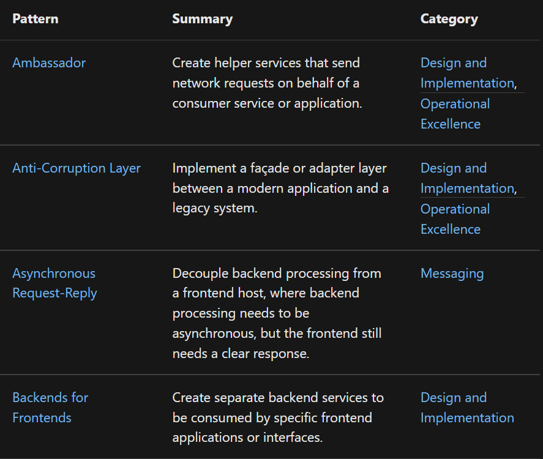
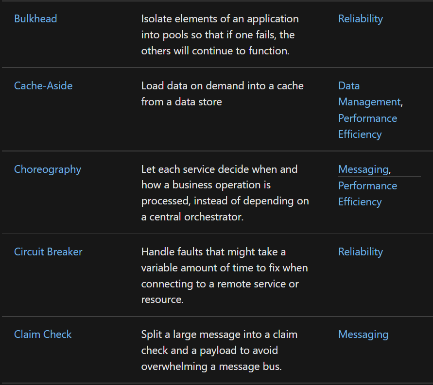
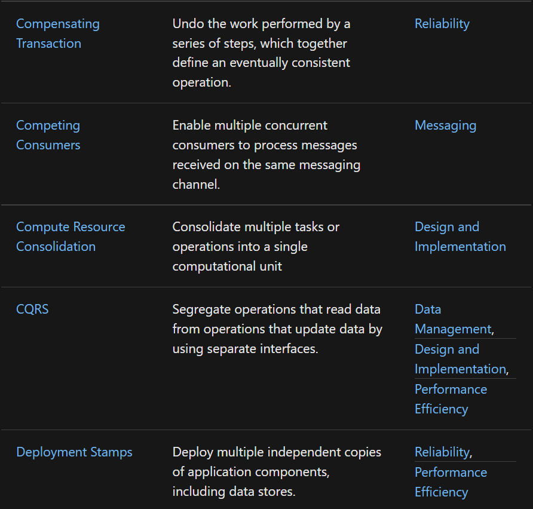
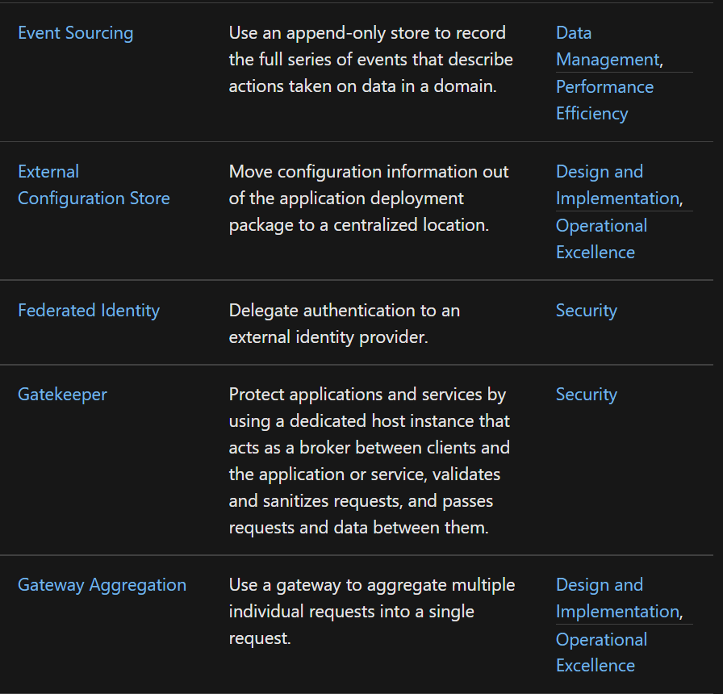
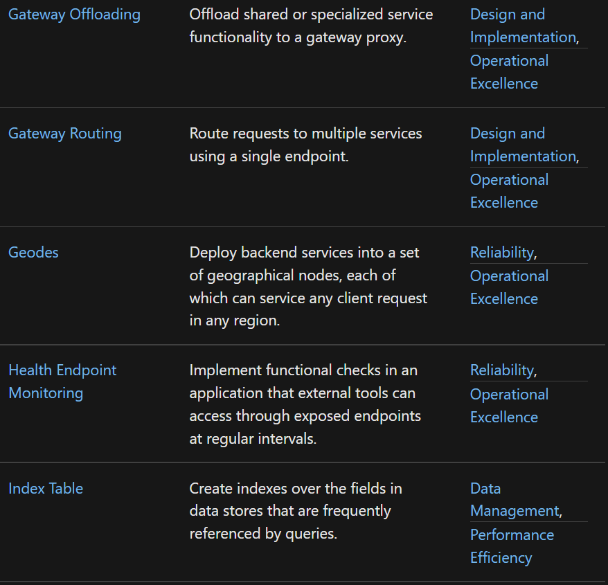
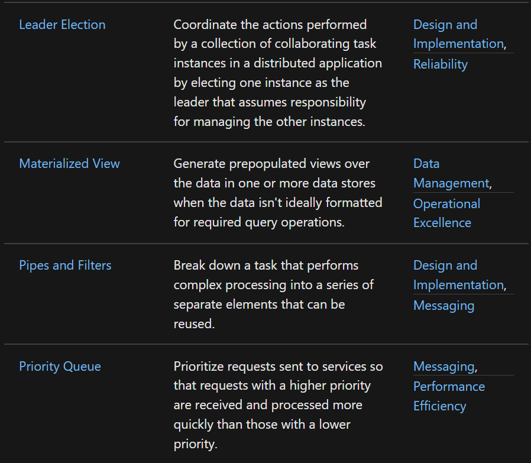
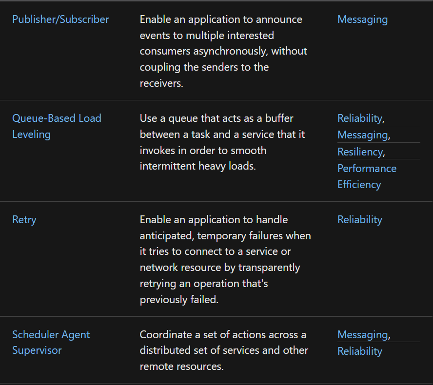
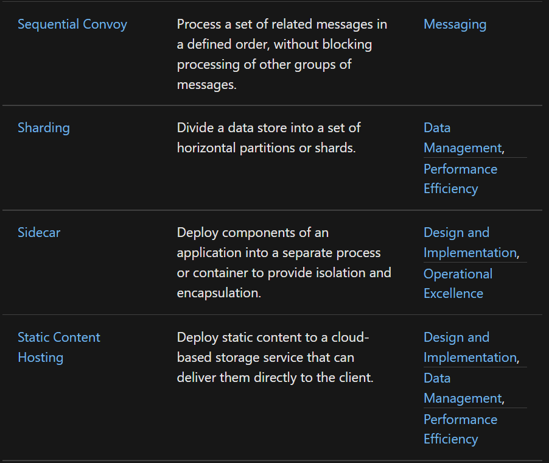
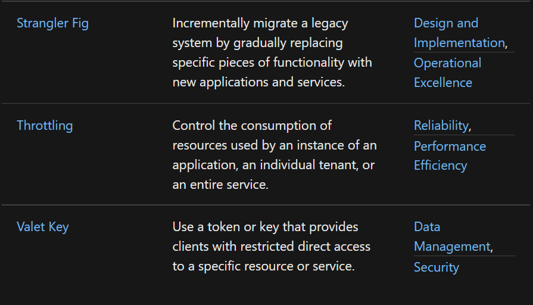