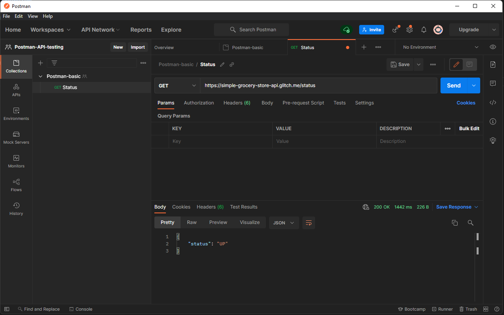
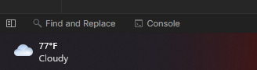
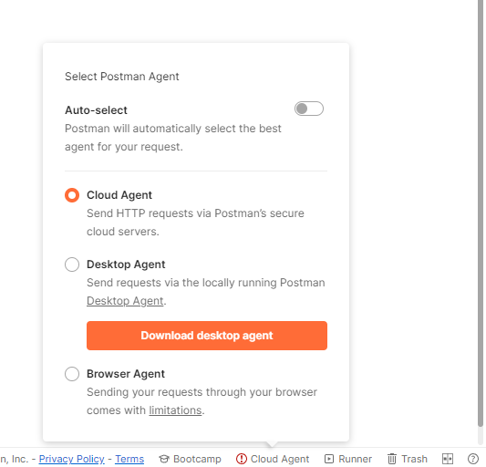
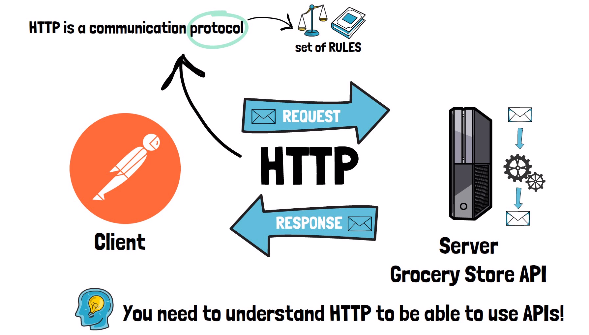
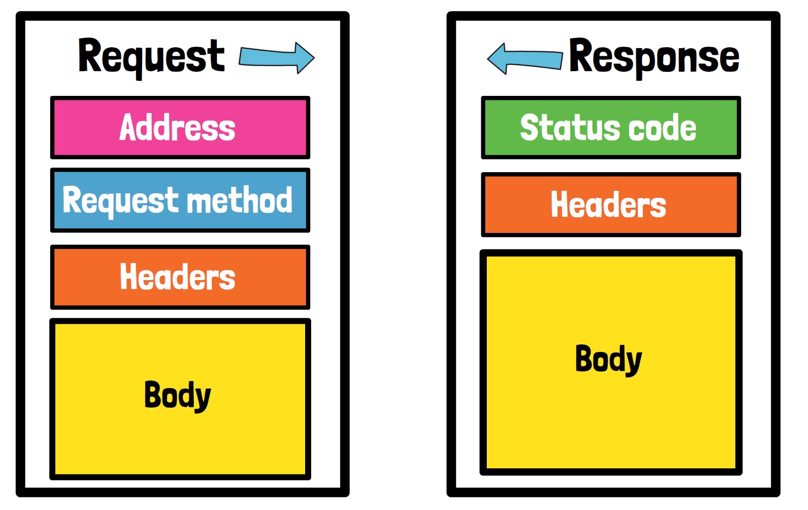
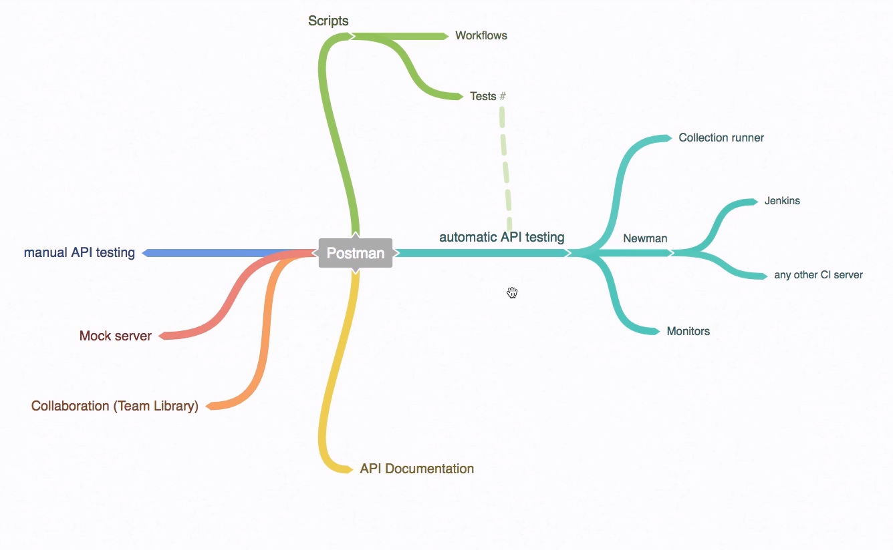

# Overview

## API - Application Programming Interface
* It ensures a specification and interoperability. 
* WEB APIs - work over the internet and provides a way to expose server functionality through a contact. 
* They dont have a friendly interface like an mobile app this is where we can use swagger/postman to consume this functionality. 

## First API Call using Postman
* [API Documentation for this example](https://github.com/vdespa/Postman-Complete-Guide-API-Testing/blob/main/simple-grocery-store-api.md)

* The Status code is 200 & response body says status as UP 

## Most common issues with Postman
1. Typo error in typing url/headers/body
2. Not Found Error: If postman prompts to view in console then you can read logs from console and try to figure out the request. Also console can be opened from bottom left

3. Sometimes company vpn / proxy may block it so you can check if an API is accessible outside the company network. 
> **NOTE** Another alternative to this is to use postman web portal to send the same request. 

## Postman web
* URL : https://www.postman.com/planetary-meteor-85425/workspace/new-team-workspace/documentation/18249768-38adacb4-d8f7-4365-9ee0-fa1d59a3bd03
* From bottom right in web version you can select the Agent from which you want to generate the request.
* You can use cloud agent which send request from postman cloud servers. There is a limited number of request you can send from cloud agent. 
* You can also install a desktop agent which is a small program that needs to be installed and using that we can send multiple requests from postman on web but the desktop agent needs to be running in background.  

## Http 

* All the above information about request and response is visible from the postman gui. 

# Postman Landscape
