# Creating REST API requests with Postman
* A postman `collection` is a place where we can store our requests. 
* A postman `request` will have default name of URL but it is good to give meaningful names. If we can any changes to collection/request we need to save this as well. 

## Storing Configuration in Variables
* let say we have 20 request in a collection and base url changes so it is good to store it in variable. 
* If you select a text then postman would be pop an option to set it as variable.
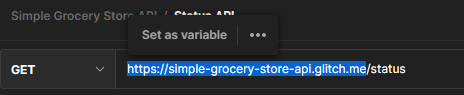
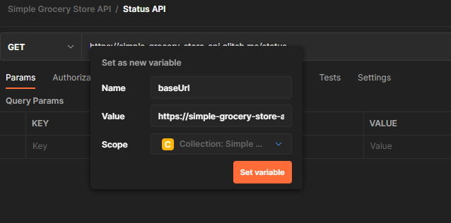
* We can choose the scope of the variable. 
* **Variable syntax**: `{{variableName}}`
* You need to save request after creating a variable

## Modifying Collection variables
* You need to go to this collection by clicking on the 3 dots when you hover over collection name then from context menu click on edit. 
* Then you can go to variables tab and edit the variable
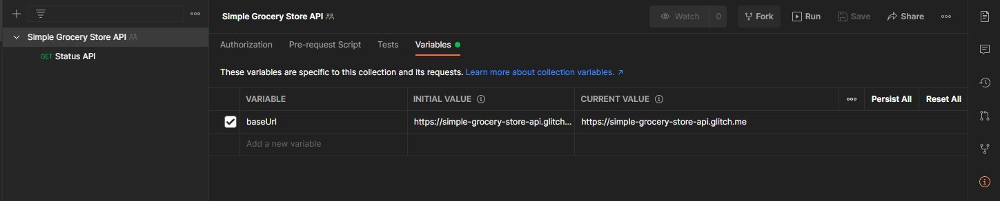
* The `initial-value` will be used when you share the collection. The `current-value` is a local private variable for your collection visible to only you even if team is collaborating on same collection. 
* If your variable has secret data then you can set some dummy initial value.

## Get Request
* `Endpoint`: Address of the url where you are sending the request. 
* `Resources`: With REST we deal with resources like here product is resource. 
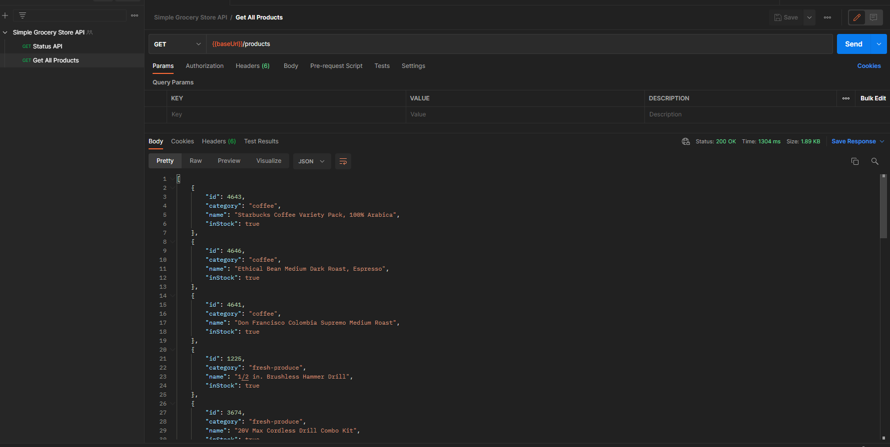

## Visualizing Response
* In your `Body` section in postman-gui we have options like **pretty, raw, review, visualize**
* It has has by default json formatting selected. 
* **Preview** makes sense with different types of data from any endpoint. Eg make get request to netflix.com

## Query Parameter
* Casing it important for the query parameters. 
* **Syntax**: `?<param_name>=<value>&<param_name2>=<value2>...`
* if a query param is options and you send wrong param then api doesn't report error. 
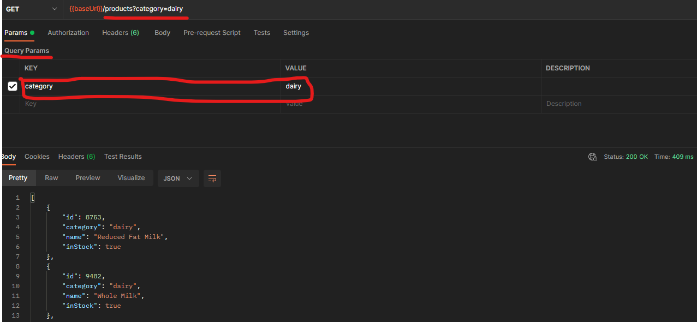

## Shortcuts
* Go to gear icons in top right then go to shortcuts, then you can go to shortcuts tab. 
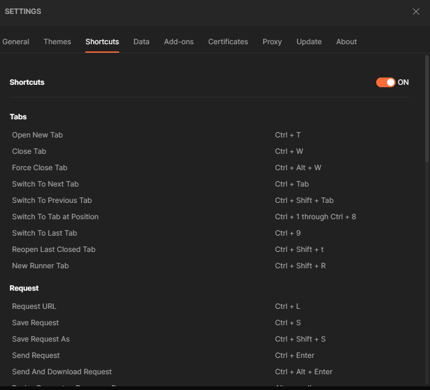

## Path Variables
* **Syntax**: `baseurl/<endpoint>/:pathParamName=pathParamValue`
 
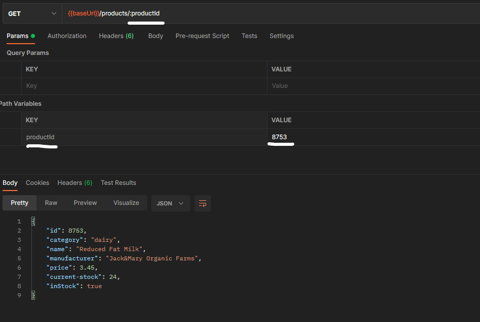

# Post
* In below sample we are going to make a post request for no body. The status would return 201 Created. 
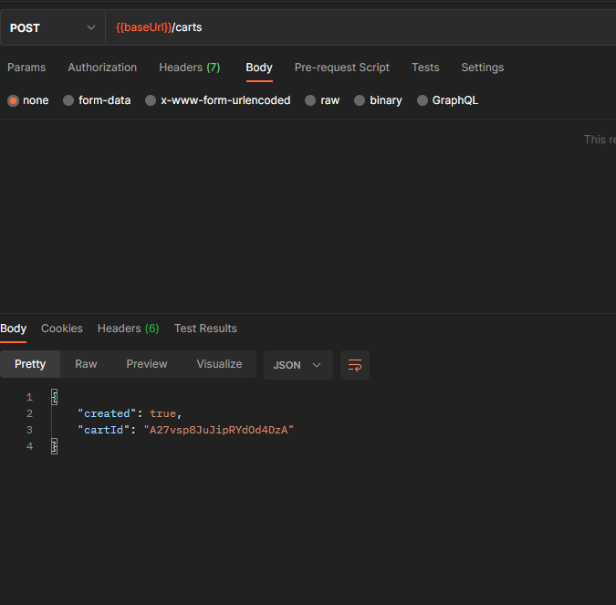
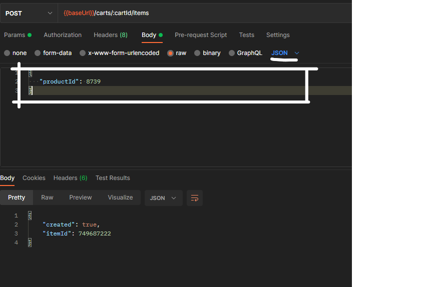

## GET vs POST 
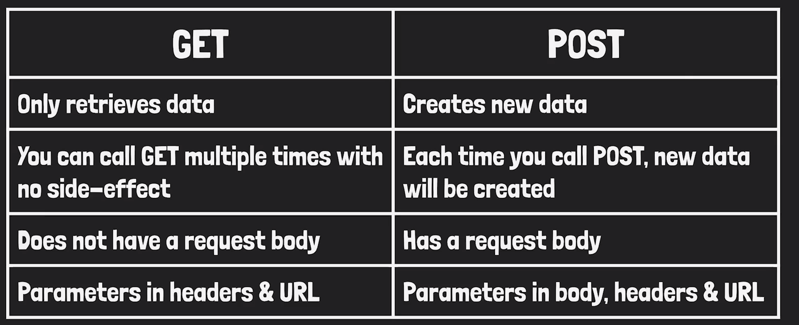

# API Authentication
* First you need to figure out authenticate mechanism for API and get the right access token, client-id, client-secret, username, password , ect
* Sample Call to get access token 
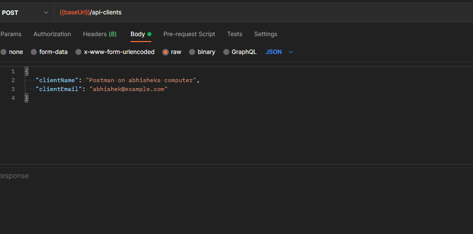
* Then we can go to collection and store it in variable, because access-token is a secret data , the initial value we can keep empty or give a message 
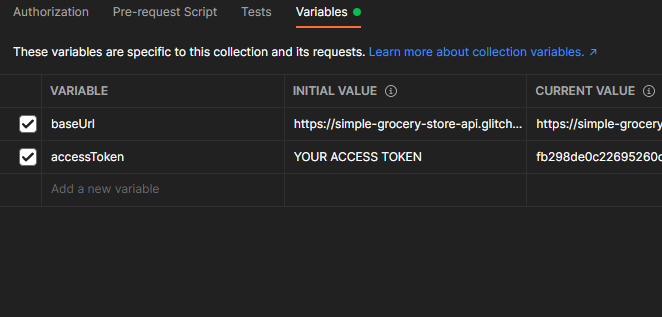
* Then all we need to do it pass it to the API call using the right mechanism for this we can go to the authorization tab. 
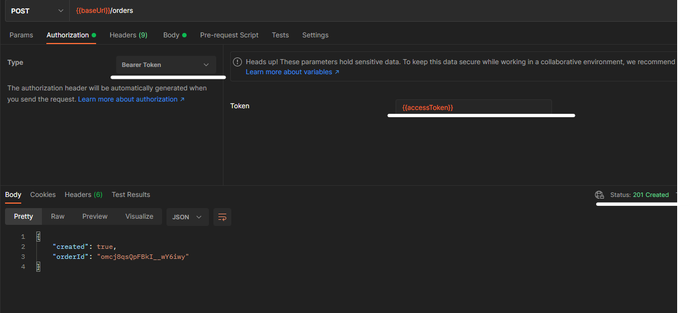

## Using Random data in request
* To pass a random data in body start with {{$ and it will give you suggestions for all random data generator functions available. 
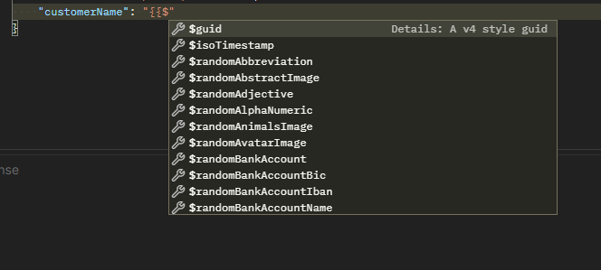
* You can see in console output the body for the request send has a randomly generated name. 
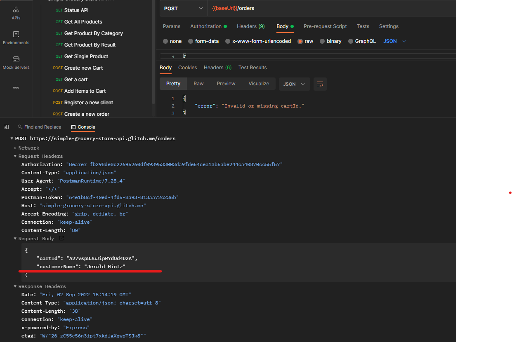

## Http Headers 
* **Content-Type**: Telling api what type of request we are sending to API 
* Responses also have headers which are returned by the API. 
* headers are key value pair. 
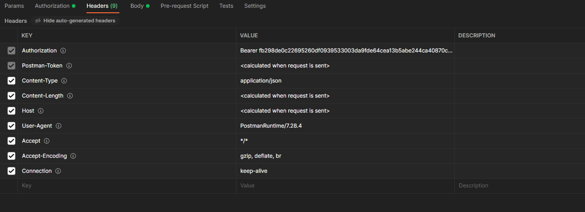
* Headers are used instead of body as they are intended to provide some additional information about the message we sent to api and adding this data to body will clog the body and make it have unnecessary attributes in body.
* Postman automatically adds most typical headers we need. 

### Headers vs query param vs path param 
* Query param and path param are about resource addresses. 

## Sharing postman collection 
* We have multiple options to share, one of them being sharing collection via link 
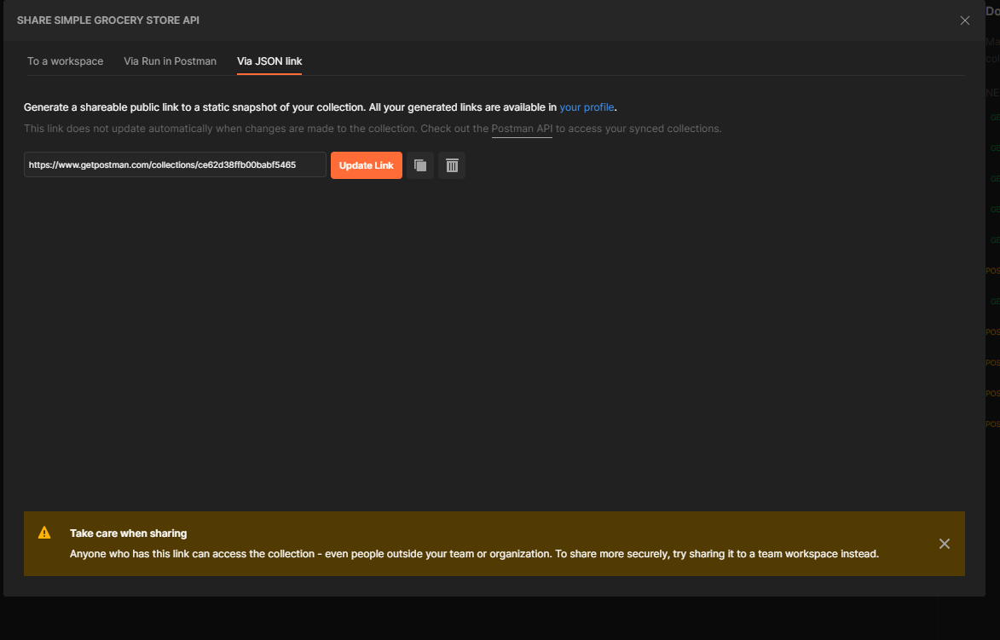
* You can also export the collection. 

## Patch Request
* Patch means to fix/repair something.
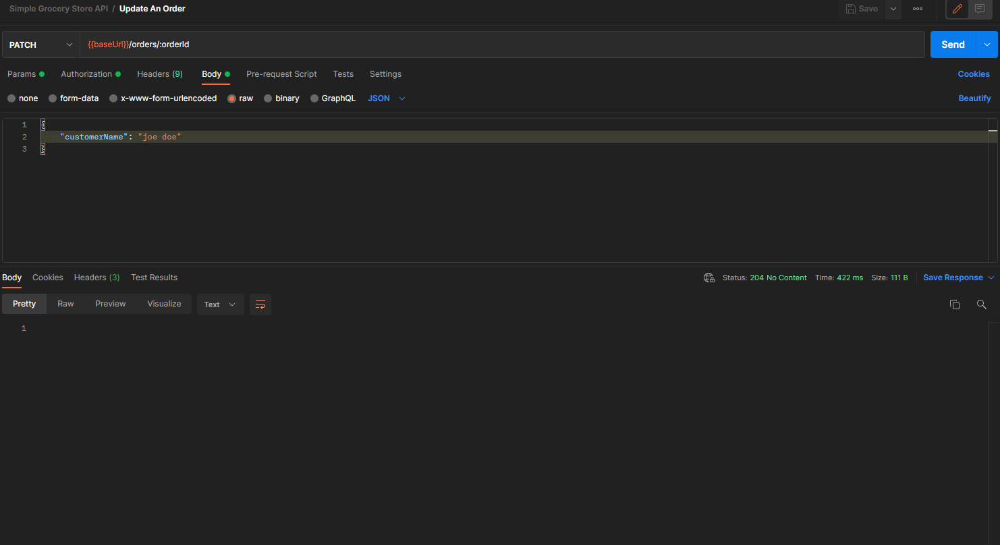
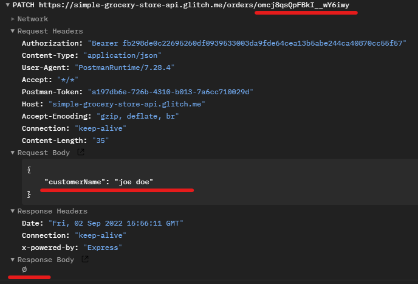

## HEAD Request Message
* This is a special http method, it doesn't have request/response body but it is a way to check if API is up and running without having to send an heavy request