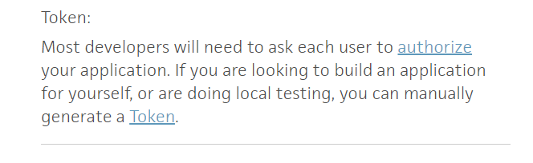

# Trello APIs - Postman
* **API Documentation**: https://developer.atlassian.com/cloud/trello/rest/api-group-actions/ 
* **Trello API Introduction**: https://developer.atlassian.com/cloud/trello/guides/rest-api/api-introduction/ 
* **API Key**: To get the API key first sign in to trello and then go to https://trello.com/app-key and generate your key. 
* Post you got your API key you need to generate your token manually by clicking the Token Link. 

