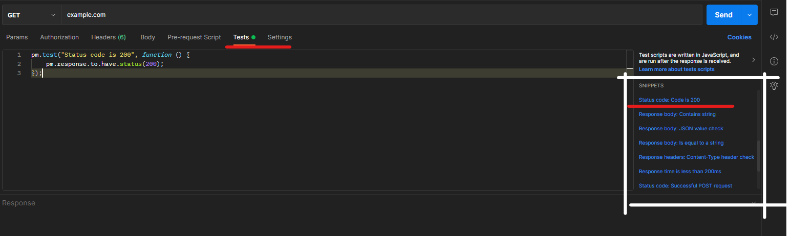

# API Test Scripts
[Postman Quick Reference Guide and Cheat Sheet](https://postman-quick-reference-guide.readthedocs.io/en/latest/)

* A test is commonly just an assertion in which we assert the actual value with expected value. 
* One request can have multiple tests. 
* tests only run AFTER the request has completed.

* To write test for a request we need to go to the test tab. There in right corner postman shows suggestions for various tests which we can write. By clicking on test we can load it.



```js
pm.test("Status code is 200", function() {
    pm.response.to.have.status(200)
})
```
* pm.test - function for writing test specifications
* works in a non-blocking way in case of errors
* Can include multiple assertions
* The first parameter is the test name as a String
* The second parameter is a so-call callback function which is called when he underlying execution(in this case assertions) has finished.
* **pm.response** - is the response assertion API and can make assertions on the response object (status code, header, body)

```javascript
pm.test("Status code is 200", function () {
    pm.response.to.have.status(200);
});

const jsonData = pm.response.json();

pm.test("Board should be Fetched", function(){
    pm.expect(jsonData.name).to.eql("TestBoard")
    pm.expect(jsonData.closed).to.eql(false)
})

pm.test("Check permission level for created board is private", function(){
    pm.expect(jsonData.prefs.permissionLevel).to.eql("private")
})

console.log(jsonData)
```