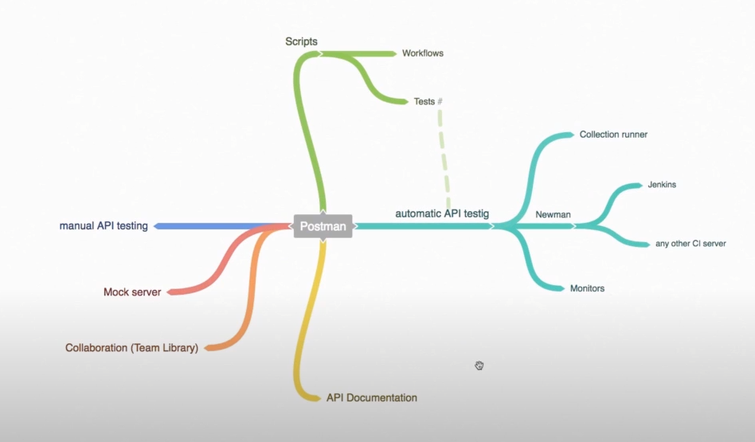

# Automatically running tests
* We can automate using
    1. Collection running 
    2. Postman monitors (Pro feature)
    3. Newman 
    4. Newman + Jenkins 
    5. Newman + other CI servers

## Postman Collection runner 
* After clicking on a collection you will get a **Run** Button and clicking on it will open the collection runner. 
* You need to select the environment, all requests you want to run , iterations, delay, etc

* Once run is completed you will get the run summary and you can export the report as well. 

* You get history of all runs in the history tab in left panel

## Postman Monitor 
* It allows to run api calls at regular intervals. This is pro feature but currently we can make 1000 call/month. 
* You need to go monitor tabs and create a monitor by filling in all details. 
* Postman server are not in the same network as you are. 
* We cannot import global variables but they can be created from scripts. 
* Global and environment variables are not persisted for later runs. 

## Automating with Newman
* It is a gateway for integrating to any CI tool and automating test run. 
* It is a CLI tool which allows you to run a postman collection directly from command line 

### Installing new man
* You need to have an node.js installation in your system as a pre-requisite. to verify `node --version`
* npm (node package manager) is also need to be pre-installed to verify `npm --version`
* **Install newman globally**: `npm install -g newman`
* to verify run : `newman --version`

### Running a collection in postman 
* `newman run <collection-json-link>`
* https://www.getpostman.com/collections/ce62d38ffb00babf5465 

### Accessing collections from newman
* If you are using link method to run test, then if you make changes to collection then you will need to click update link in share menu 
* You can export the collection, then open terminal in the same directory collection.json exists. 
* `newman run "collectionName.json"`

### Specifying environments with newman
* We can either export the environment or use the environment link. 
* `newman run "Trello API Automation.postman_collection.json" --environment "Trello API Automation.postman_environment.json"`
> **NOTE**: If you have not set the right initial values for environment variables you may get an error, in that case you will have to edit the export environment.json file

### Generating Html reports from newman 
* For this first we need to install the newman reporter. You need to also install it in your CI server. 
[Link to full report](../src/trello-automation-flow/Trello%20API%20Automation-2022-09-03-13-56-47-054-0.html)
> npm i -g newman-reporter-htmlextra
* post that whenever you want generate report you need to append command with `--reporters=htmlextra`

* Then a new directory will be created with name newman which has report. 

