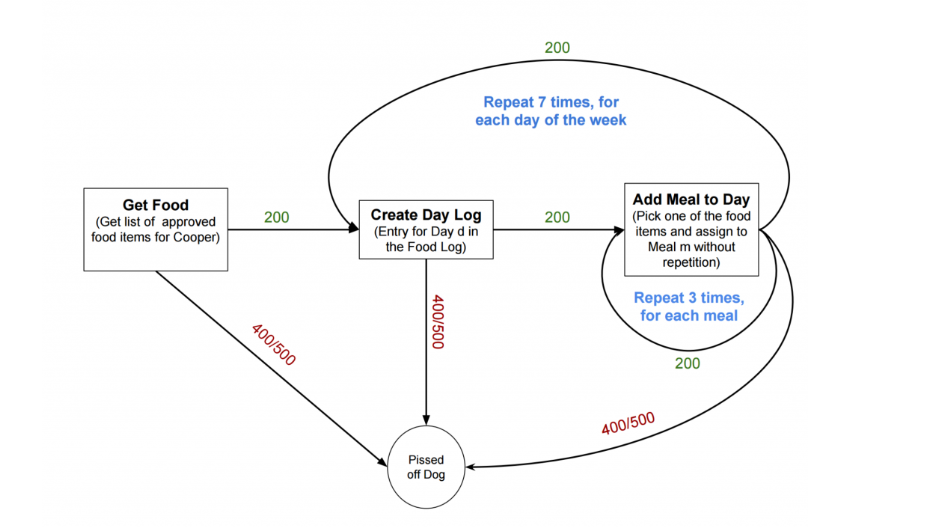
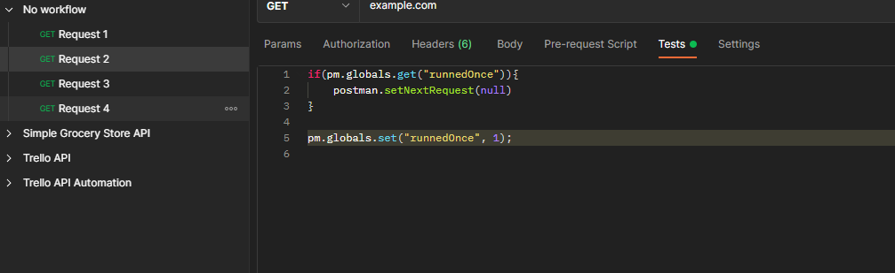
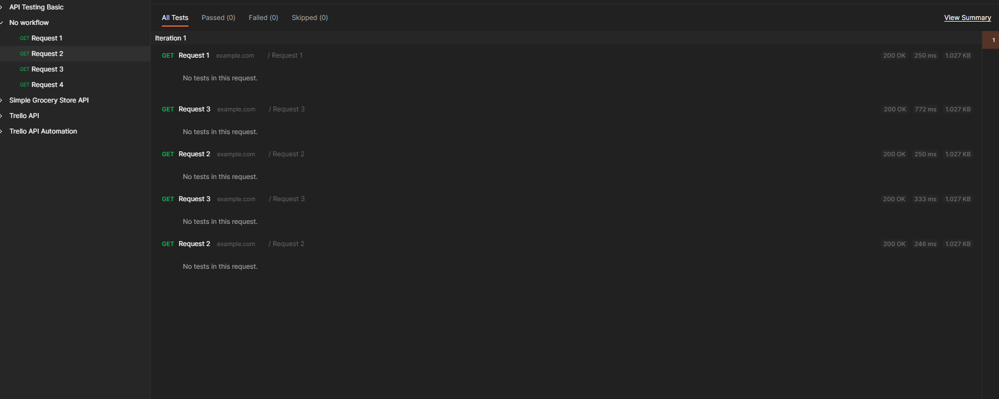

# Workflows and scenarios

* with workflows we dont have to call requests sequentially but on conditions we can call any request. 
* `postman.setNextRequest("Request Name");` this method allows us to declare the order in which we want to execution. 
* To halt the execution we need to pass the null as request name
* It is important to pass null to stop else it will go in an endless loop. 
* This function needs to be written in test tab
* **Example** if we are on second request and it hasn't already run once then we need postman to continue it's normal behavior that is to go to the next request and so in our example it will go to request 3 and from there then due to our code it will go to request 2 and see that the request 2 has already run once so it will terminate. To achieve this we need to set a global variable "runnedOnce"




* Methods
```js
postman.setNextRequest("Request Name");
pm.info.requestName: String 
postman.setNextRequest("Request Id");
pm.info.requestId: String
```

## Multiple worksflows within same collection : https://www.youtube.com/watch?v=FWYKOR0Zj28 