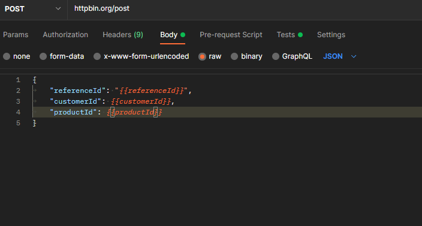

# Data Driven Tests
* We can run test using different data sets in postman. 
* **Ways**
    1. Duplicate the request and change the data 
    2. Use external data files. 
    3. Use pre-request scripts, variables and workflows. 

## Using pre-request scripts
* [Postman-collection click here](../src/data%20driven%20tests/Using%2Bworkflows%2Bto%2Bcreate%2Bdata-sets.json)

## Using external files
* [Postman collection click here](../src/data%20driven%20tests/Order%2Bmanagement.postman_collection.json)
* [External data file here](../src/data%20driven%20tests/data-1.json)
1. Go to collection runner and import the data file json 

2. Now edit the body and add in {{}} the attributes which you want to read from the json file 

3. Now if you go to the collection runner and preview file , you will get the data and how many iterations should be running. 

* If you want to assert on iteration data then you need to use method `pm.variables.get("iterationVariableName")` or `pm.iterationData.get("iterationVariableName")`

